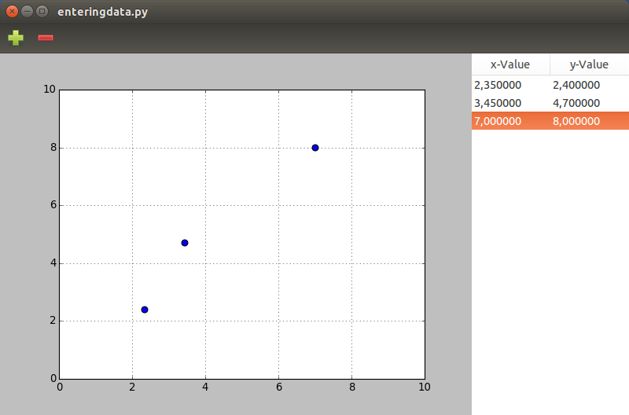

.. _matplotlib-toolbar:

Entering data
=============
In this chapter we will build the first program that will allow data to be entered and immedietly graphed. The data will be (temporarily) stored in a *Gtk.ListStore* and viewed and changed by using *Gtk.TreeView*. A program like this might be useful for class-room demonstrations, but in the next chapters we will add data input and output to these examples to build fully fledged data processing programs.

Point plotting with Gtk.TreeView
^^^^^^^^^^^^^^^^^^^^^^^^^^^^^^^^
The first example we will build will consist of a table (a *GTKTreeView*) and a Matplotlib-graph. The table has two columns for x-y-coordinates which will be plotted in the graph.

The program requires the following imports:

::

    #!/usr/bin/python3
    
    from gi.repository import Gtk
    from matplotlib.figure import Figure
    #Possibly this rendering backend is broken currently
    #from matplotlib.backends.backend_gtk3agg import FigureCanvasGTK3Agg as FigureCanvas
    from matplotlib.backends.backend_gtk3cairo import FigureCanvasGTK3Cairo as FigureCanvas

I decided to put the whole program into a class. First we have to set up the window, the layout and a *Gtk.Toolbar*. The two lines starting with *self.context* ensure that the toolbar will be styled similar to your operating system.

::

    class MainClass():
        def __init__(self):
            self.window = Gtk.Window()
            self.window.set_default_size(800, 500)
            self.boxvertical = Gtk.Box(orientation=Gtk.Orientation.VERTICAL)
            self.window.add(self.boxvertical)
            
            self.toolbar = Gtk.Toolbar()
            self.context = self.toolbar.get_style_context()
            self.context.add_class(Gtk.STYLE_CLASS_PRIMARY_TOOLBAR)
            self.boxvertical.pack_start(self.toolbar, False, False, 0)
        
Then we have to create two buttons and add them to the toolbar on position 0 and 1. Then add the toolbar to our layout. The two buttons are also connected to their respective function when they are clicked.

::

        self.addbutton = Gtk.ToolButton(Gtk.STOCK_ADD)
        self.removebutton = Gtk.ToolButton(Gtk.STOCK_REMOVE)

        self.toolbar.insert(self.addbutton, 0)
        self.toolbar.insert(self.removebutton, 1)
        
        self.addbutton.connect("clicked", self.addrow)
        self.removebutton.connect("clicked", self.removerow)

        self.box = Gtk.Box()
        self.boxvertical.pack_start(self.box, True, True, 0)

Next we set up the figure and add it to the layout.

::

        self.fig = Figure(figsize=(10,10), dpi=80)
        self.ax = self.fig.add_subplot(111)
        self.canvas = FigureCanvas(self.fig)
        self.box.pack_start(self.canvas, True, True, 0)

Next we will set up the *Gtk.ListStore* and the *Gtk.TreeView*, connect the columns to their respective function. We can also add two values to the columns, just that the graph and table won't be empty on startup.

::

        self.liststore = Gtk.ListStore(float, float)
        self.treeview = Gtk.TreeView(model=self.liststore)
        self.box.pack_start(self.treeview, False, True, 0)

        self.xrenderer = Gtk.CellRendererText()
        self.xrenderer.set_property("editable", True)
        self.xcolumn = Gtk.TreeViewColumn("x-Value", self.xrenderer, text=0)
        self.xcolumn.set_min_width(100)
        self.xcolumn.set_alignment(0.5)
        self.treeview.append_column(self.xcolumn)
        
        self.yrenderer = Gtk.CellRendererText()
        self.yrenderer.set_property("editable", True)
        self.ycolumn = Gtk.TreeViewColumn("y-Value", self.yrenderer, text=1)
        self.ycolumn.set_min_width(100)
        self.ycolumn.set_alignment(0.5)
        self.treeview.append_column(self.ycolumn)

        self.xrenderer.connect("edited", self.xedited)
        self.yrenderer.connect("edited", self.yedited)

        self.liststore.append([2.35, 2.40])
        self.liststore.append([3.45, 4.70])
        
The *resetplot* function clears the axis, resets the limits and recreates the grid:

::

    def resetplot(self):
        self.ax.cla()
        self.ax.set_xlim(0,10)
        self.ax.set_ylim(0,10)
        self.ax.grid(True)

The *plotpoints* function calls the *resetplot* function and iterates over the rows of the liststore. For each row one point is created. Then the *fig.canvas.draw()* command updates the plot.

::

    def plotpoints(self):
        self.resetplot()
        for row in self.liststore:
            self.ax.scatter(row[:1], row[1:], marker='o', s=50)
        self.fig.canvas.draw()

The *xedited* and *yedited* functions first ensure that the comma is conveerted to a ".", so Python can work with them. This is important so your program will work independent of the format of the decimal point. The value is then added to the *Gtk.ListStore*. Then the *plotpoints* function is called.

::

    def xedited(self, widget, path, number):
        self.liststore[path][0] = float(number.replace(',', '.'))
        self.plotpoints()
        
    def yedited(self, widget, path, number):
        self.liststore[path][1] = float(number.replace(',', '.'))
        self.plotpoints()

The *addrow* and *removerow* function appends or removes a row from the *Gtk.ListStore*. To remove a row, we first have to query which row is currently selected. Either action calls the *plotpoints* funtion.

::

    def addrow(self, widget):
        self.liststore.append()
        self.plotpoints()

    def removerow(self, widget):
        self.select = self.treeview.get_selection()
        self.model, self.treeiter = self.select.get_selected()
        if self.treeiter is not None:
            self.liststore.remove(self.treeiter)
        self.plotpoints()

The end of the code creates an instance of the *MainClass*, sets up the plot using *resetplot* and plots the initial points. We also have to connect the window to the *delete-event*, calls the window and starts the Gtk main loop.

::

    mc = MainClass()
    mc.resetplot()
    mc.plotpoints()
    
    mc.window.connect("delete-event", Gtk.main_quit)
    mc.window.show_all()
    Gtk.main()
    
The finished program under Ubuntu looks like this:

Further Reading
^^^^^^^^^^^^^^^
 - Python GTK+ 3 Tutorial: `Tree and List Widgets <http://python-gtk-3-tutorial.readthedocs.org/en/latest/treeview.html>`_
 - AskUbuntu: `What is the black header widget in some programs? <http://askubuntu.com/questions/67362/what-is-the-black-header-widget-in-some-programs>`_