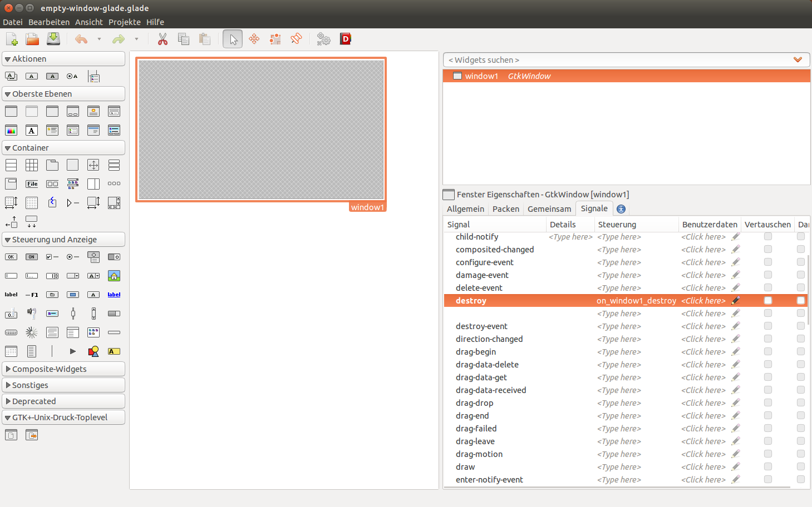
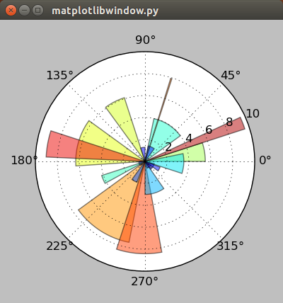
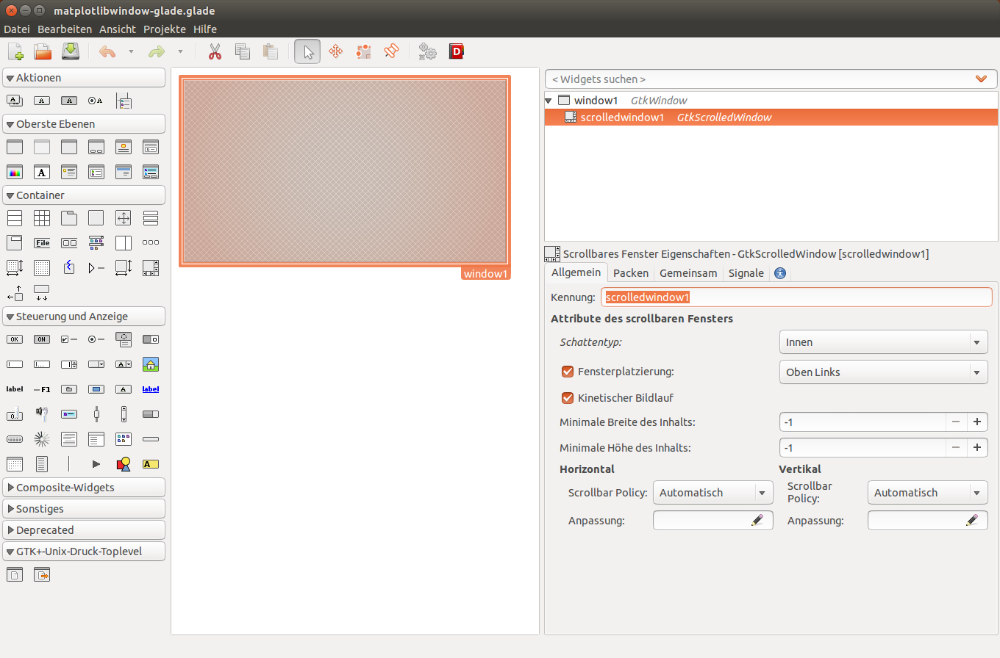

.. _hello-plot:

Hello plot!
============
The first chapter will explain how to open an empty GTK3-window and then how to embed Matplotlib into it.

For small applications the GTK3-code can be easily integrated into the Python-code. Building the interface with Glade is a little more complicated in the beginning. With increasing size though, the usage of Glade will become more useful.

Empty GTK 3 window
------------------
Let's start with the code that will open an empty window.

::
    
    #!/usr/bin/python3
    
    from gi.repository import Gtk
    
    myfirstwindow = Gtk.Window()
    
    myfirstwindow.connect("delete-event", Gtk.main_quit)
    myfirstwindow.show_all()
    Gtk.main()
    
These are all the lines that are required for a fully functional window. This is what they do:

The first line helps Unix operating systems to recognize the file format of a file. In this case we wan't the operating system to know that the file should be excecuted with Python 3.x:

::

    #!/usr/bin/python3

Then the program needs to import the gui-framework (or gui-toolkit). Older Gtk 2.x applications used (*import gtk*), but for Python 3 and Gtk 3.x applications (i.e. this tutorial) we need:

::

    from gi.repository import Gtk

We can then define an object for a *Gtk.Window()*, which can have any name:

::

    myfirstwindow = Gtk.Window()
    
Next the we have to connect our program with the quit-button (x-button) of the window. Otherwise closing the window will not terminate the application:

::

    myfirstwindow.connect("delete-event", Gtk.main_quit)

The next line ensures that the program window is shown. Excluding this line will mean that the program start, but no window is displayed:

::

    myfirstwindow.show_all()

The last line starts the main program loop with all functions. Without this line no loop is started and the program will not do anything:

::

    Gtk.main()

Empty window with Glade
^^^^^^^^^^^^^^^^^^^^^^^
Opening an empty window with Glade takes a little more effort. First we need to open the Glade interface designer. Then drag a *GtkWindow* into the workspace. By default the window will be named *"window1"*, which we can keep. Then we have to set a signal for that window, so we can later close it. The signal we need is *"GtkWidget --> destroy"* and in the column process we can set *"on_window1_destroy"*. This will also be the name of the function in the Python code.

    The steps in Glade are: Create a *GtkWindow*, then open the Signals tab and enter *"on_window1_destroy"* for *"GtkWidget --> destroy"*.

This is all we need for an empty (and closable) window. Then we can save the file with the extension *".glade"*. The finished XML-code of that file looks like this and should be fairly easy to understand:

::

    <?xml version="1.0" encoding="UTF-8"?>
    <!-- Generated with glade 3.16.1 -->
    <interface>
      <requires lib="gtk+" version="3.10"/>
      <object class="GtkWindow" id="window1">
        <property name="can_focus">False</property>
        <signal name="destroy" handler="on_window1_destroy" swapped="no"/>
        <child>
          <placeholder/>
        </child>
      </object>
    </interface>
    
Now we have to create a separate file to hold the python code that will call the Glade-file. The finished code looks like this:

::

    #!/usr/bin/python3

    from gi.repository import Gtk

    class Signals:
        def on_window1_destroy(self, widget):
            Gtk.main_quit()

    builder = Gtk.Builder()
    builder.add_objects_from_file('empty-window-glade.glade', ('window1', '') )
    builder.connect_signals(Signals())

    myfirstwindow = builder.get_object('window1')

    myfirstwindow.show_all()
    Gtk.main()
    
In comparison to the previous approach a few lines of code have changed. First we call the *Gtk.Builder()* function:

::

    builder = Gtk.Builder()

Then we use the *Gtk.Builder()* to add the objects from the Glade-file. In the bracket we first need to specify the Glade-file, and then a list of objects even if we just want to call one object (*Thankyou errol from http://www.gtkforums.com for this tip*):

::

    builder.add_objects_from_file('empty-window-glade.glade', ('window1', '') )
    
Next the builder needs to connect the signals that we defined in the Glade file. The easiest way of doing this is to place the Signals in their own *Class*. We only defined one signal in Glade which was *"on_window1_destroy"*:
    
::

    builder.connect_signals(Signals())

    class Signals:
        def on_window1_destroy(self, widget):
            Gtk.main_quit()
            
The last two lines of the program are the same as for the previous example.

Further Reading
^^^^^^^^^^^^^^^^^^^^^^^
 - `Python GTK+ 3 Tutorial: Getting started <http://python-gtk-3-tutorial.readthedocs.org/en/latest/introduction.html>`_
 - `GTK+ 3 Reference Manual <https://developer.gnome.org/gtk3/>`_
 - `GTK+ 3 Reference Manual: GtkBuilder <https://developer.gnome.org/gtk3/stable/GtkBuilder.html>`_
 - `Glade - A user interface designer <https://glade.gnome.org/>`_

Embedding Matplotlib
--------------------
Now that we have an empty window we will learn how to place Matplotlib into it. The main differences are that we need to import Matplotlib-specific packages, insert our Matplotlib-code and place the resulting *FigureCanvas* in a *Gtk.ScrolledWindow* (which is a child-element of the *Gtk.Window*).

We will look at an example that will produce a random radial plot on each application start (adapted from http://matplotlib.org/dev/examples/pie_and_polar_charts/polar_bar_demo.html). The finished  Python-code is:

::

    #!/usr/bin/python3

    from gi.repository import Gtk

    from matplotlib.figure import Figure
    from numpy import arange, pi, random, linspace
    import matplotlib.cm as cm
    #Possibly this rendering backend is broken currently
    #from matplotlib.backends.backend_gtk3agg import FigureCanvasGTK3Agg as FigureCanvas
    from matplotlib.backends.backend_gtk3cairo import FigureCanvasGTK3Cairo as FigureCanvas

    myfirstwindow = Gtk.Window()
    myfirstwindow.connect("delete-event", Gtk.main_quit)
    myfirstwindow.set_default_size(400, 400)

    fig = Figure(figsize=(5,5), dpi=100)
    ax = fig.add_subplot(111, projection='polar')

    N = 20
    theta = linspace(0.0, 2 * pi, N, endpoint=False)
    radii = 10 * random.rand(N)
    width = pi / 4 * random.rand(N)

    bars = ax.bar(theta, radii, width=width, bottom=0.0)

    for r, bar in zip(radii, bars):
        bar.set_facecolor(cm.jet(r / 10.))
        bar.set_alpha(0.5)

    ax.plot()

    sw = Gtk.ScrolledWindow()
    myfirstwindow.add(sw)

    canvas = FigureCanvas(fig)
    canvas.set_size_request(400,400)
    sw.add_with_viewport(canvas)

    myfirstwindow.show_all()
    Gtk.main()
    

    The first window with an embedded Matplotlib-graph as it renders in Ubuntu 14.04.
    
As you probably noticed we imported a few more modules. The module *matplotlib.figure* is required to render the graph. We need some functions from *NumPy* for evenly dividing an interval (*numpy.arange*), the value for the constant pi (*numpy.pi*), a function for random numbers (*numpy.random*) and a function that returns evenly spaced numbers in an interval (*numpy.linspace*). We also need the colormap function (*matplotlib.cm*). The container in which the graph is rendered is the *FigureCanvasGTK3Agg* or *FigureCanvasGTK3Cairo*.

::

    from matplotlib.figure import Figure
    from numpy import arange, pi, random, linspace
    import matplotlib.cm as cm
    #Possibly this rendering backend is broken currently
    #from matplotlib.backends.backend_gtk3agg import FigureCanvasGTK3Agg as FigureCanvas
    from matplotlib.backends.backend_gtk3cairo import FigureCanvasGTK3Cairo as FigureCanvas
    
In order to give the plot a sufficient default size we add this line:

::

    myfirstwindow.set_default_size(400, 400)

Next we create an instance of a *matplotlib.figure* and define its size and resolution. The resolution is a fixed value, which means that your plots will probably not look the same on newer display with very high pixel-densities. 100 dpi ("dots per inch", which is a very annoying non-metric unit) works well for regular screens which is about 40 pixels per cm.

::

    fig = Figure(figsize=(5,5), dpi=100)
  
Then we add a subplot to the plot (This sounds a little weird for only one graph, but you can acutally add many subplots to one plot). 111 means that we have a 1 x 1 grid and are putting the subplot in the 1st cell. Because we want to create a polar plot, we have to set *"projection='polar'"*.
    
::

    ax = fig.add_subplot(111, projection='polar')

Next we will define the number of intervals, and divide a full circle (in radian-units: 2*pi) by that number. Then we create random arrays for 20 radiis and 20 widths for the histogram bars. You can test if the program uses an array by trying *"radii = [1,2,3,4,5,6,7,8,9,10,11,12,13,14,15,16,17,18,19,20]"* to create bars that have radii from 1 to 20.

::
    
    N = 20
    theta = linspace(0.0, 2 * pi, N, endpoint=False)
    radii = 10 * random.rand(N)
    width = pi / 4 * random.rand(N)
    
Then we assign the newly created bars to our plot and store them in a variable:

::

    bars = ax.bar(theta, radii, width=width, bottom=0.0)
    
We can use this variable *"bars"* to customize the plot. We will do this for the color in the next piece of code. This algorithm assigns each radius a different color using the *"cm.jet"* color scheme (See `Matplotlib: Colormaps reference <http://matplotlib.org/examples/color/colormaps_reference.html>`_ for more color maps). Additionaly the alpha of each histogram-bar is set to "0.5".

::

    for r, bar in zip(radii, bars):
        bar.set_facecolor(cm.jet(r / 10.))
        bar.set_alpha(0.5)
        
In the next step we plot the generated graph:

::

    ax.plot()
    
Then we just have to create a *GtkScrolledWindow*, and add it to our *GtkWindow*.

::

    sw = Gtk.ScrolledWindow()
    myfirstwindow.add(sw)
    
Finally we can create an instance of a *FigureCanvasGTK3Agg* or *FigureCanvasGTK3Cairo* with our figure included in it. Then we set the size of the canvas and add embed it into the *GtkScrolledWindow*.
  
::

    canvas = FigureCanvas(fig)
    canvas.set_size_request(400,400)
    sw.add_with_viewport(canvas)

Embedding Matplotlib with Glade
^^^^^^^^^^^^^^^^^^^^^^^^^^^^^^^
Recreating the previous example with Glade requires just some minor changes to the Glade-file and a slightly different Python-3-code.

First we need to add a *GtkScrolledWindow* to our empty window. Although the name has "window" in it, it actually is more like a canvas for other widgets. In the Python code we will place in the next step a *FigureCanvas* into the *GtkScrolledWindow*. In order to give the plot more space, we can also set the default width and height of *"window1"* to 400 px each.

    Starting with the previous example all we need to add is a *GtkScrolledWindow*.

The XML-code of the Glade-file after the modifications looks like this:

::

    <?xml version="1.0" encoding="UTF-8"?>
    <!-- Generated with glade 3.16.1 -->
    <interface>
      <requires lib="gtk+" version="3.10"/>
      <object class="GtkWindow" id="window1">
        <property name="can_focus">False</property>
        <property name="default_width">400</property>
        <property name="default_height">400</property>
        <signal name="destroy" handler="on_window1_destroy" swapped="no"/>
        <child>
          <object class="GtkScrolledWindow" id="scrolledwindow1">
            <property name="visible">True</property>
            <property name="can_focus">True</property>
            <property name="shadow_type">in</property>
            <child>
              <placeholder/>
            </child>
          </object>
        </child>
      </object>
    </interface>

Starting with the code from the previous examples we only have to make slight changes to port this example. This is the final result:

::

    #!/usr/bin/python3
    
    from gi.repository import Gtk
    
    from matplotlib.figure import Figure
    from numpy import arange, pi, random, linspace
    import matplotlib.cm as cm
    #Possibly this rendering backend is broken currently
    #from matplotlib.backends.backend_gtk3agg import FigureCanvasGTK3Agg as FigureCanvas
    from matplotlib.backends.backend_gtk3cairo import FigureCanvasGTK3Cairo as FigureCanvas
    
    class Signals:
        def on_window1_destroy(self, widget):
            Gtk.main_quit()
    
    builder = Gtk.Builder()
    builder.add_objects_from_file('matplotlibwindow-glade.glade', ('window1', '') )
    builder.connect_signals(Signals())
    
    myfirstwindow = builder.get_object('window1')
    sw = builder.get_object('scrolledwindow1')
    
    fig = Figure(figsize=(5,5), dpi=100)
    ax = fig.add_subplot(111, projection='polar')
    
    N = 20
    theta = linspace(0.0, 2 * pi, N, endpoint=False)
    radii = 10 * random.rand(N)
    width = pi / 4 * random.rand(N)
    
    bars = ax.bar(theta, radii, width=width, bottom=0.0)
    
    for r, bar in zip(radii, bars):
        bar.set_facecolor(cm.jet(r / 10.))
        bar.set_alpha(0.5)
    
    ax.plot()
    
    canvas = FigureCanvas(fig)
    sw.add_with_viewport(canvas)
    
    myfirstwindow.show_all()
    Gtk.main()
    
The most important difference to the non-Glade code is that we need to get our *GtkWindow* and *GtkScrolledWindow* from Glade using the *GtkBuilder*:

::

    myfirstwindow = builder.get_object('window1')
    sw = builder.get_object('scrolledwindow1')

Further Reading
^^^^^^^^^^^^^^^^^^^^^^^
 - `The Python Standard Library: Built-in Functions: zip <https://docs.python.org/3/library/functions.html#zip>`_
 - `Numpy <http://www.numpy.org/>`_
 - `The Matplotlib API: pyplot <http://matplotlib.org/api/pyplot_api.html>`_
 - `The Matplotlib API: figure <http://matplotlib.org/api/figure_api.html>`_
 - `The Matplotlib API: cm (colormap) <http://matplotlib.org/api/cm_api.html>`_
 - `Matplotlib: Colormaps reference <http://matplotlib.org/examples/color/colormaps_reference.html>`_
 - `Pyplot tutorial <http://matplotlib.org/users/pyplot_tutorial.html>`_
 - `Numpy: linspace <http://docs.scipy.org/doc/numpy/reference/generated/numpy.linspace.html>`_
 - `Numpy: arange <http://docs.scipy.org/doc/numpy/reference/generated/numpy.arange.html>`_
 - `Numpy: random <http://docs.scipy.org/doc/numpy/reference/routines.random.html>`_
 - `Numpy: random.rand <http://docs.scipy.org/doc/numpy/reference/generated/numpy.random.rand.html#numpy.random.rand>`_
 - FigureCanvasGTK3Agg documentation [[2014-06-21 Find link for documentation]]
 - FigureCanvasGTK3Cairo documentaion [Link needed]
 - `Stackoverflow question about subplot grids <http://stackoverflow.com/questions/3584805/in-matplotlib-what-does-111-means-in-fig-add-subplot111>`_
 
 