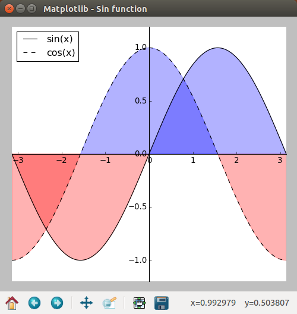
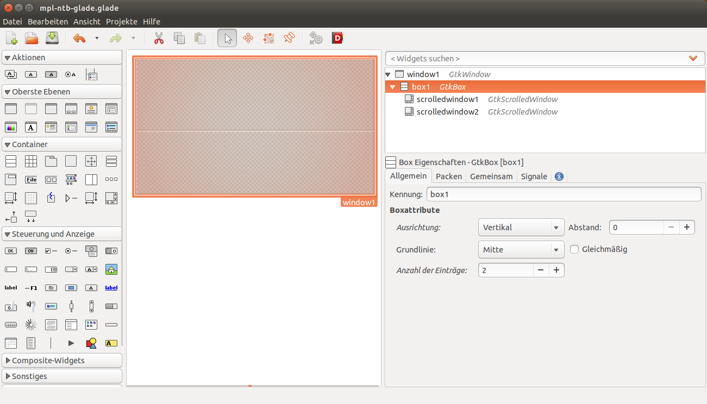

.. _matplotlib-toolbar:

Matplotlib-Toolbar
==================
In the second chapter we will design a window that includes the Matplotlib-Toolbar (or Navigation-Toolbar) that is a part of the Matplotlib-API. It has a few very useful functions, for manipulating the view of the plot, cursor tracking, and most importantly a save-button, that allows the user to save a "png" or "svg" of the plot. As a bonus we will customize the window with an icon and a title, and customize the plot with some annotations.

In order to add the toolbar we have to subdivide our *GtkWindow* into layout containers. One of the containers is going to hold the graph, while the other one will hold the Navigation-Toolbar. If you want to do the layout inside of the code you should familarize yourself with GTK layout containers (`Python GTK+ 3 Tutorial: Layout Containers <http://python-gtk-3-tutorial.readthedocs.org/en/latest/layout.html>`_). In Glade, setting up the layout can be done graphically, and the required containers are called with the *GtkBuilder* function. In both cases the Navigation-Toolbar can be imported like this:

::

    from matplotlib.backends.backend_gtk3 import NavigationToolbar2GTK3 as NavigationToolbar

    In this chapter we will program an example that plots a sine and cosine function and includes the Navigation-Toolbar.

Matplotlib-Toolbar using GTK3
^^^^^^^^^^^^^^^^^^^^^^^^^^^^^
Assuming that you worked through the first chapter, you should already be slightly familar with the structure of the program. First we need to import the required packages and functions:

::

    from gi.repository import Gtk
    
    from matplotlib.figure import Figure
    from numpy import sin, cos, pi, linspace
    from matplotlib.backends.backend_gtk3agg import FigureCanvasGTK3Agg as FigureCanvas
    from matplotlib.backends.backend_gtk3 import NavigationToolbar2GTK3 as NavigationToolbar

The next lines of code create a *GtkWindow* and in addition to lines from the first chapter we will also define a title and a icon (from a file in the same directory) for our program window:

::

    myfirstwindow = Gtk.Window()
    myfirstwindow.connect("delete-event", Gtk.main_quit)
    myfirstwindow.set_default_size(500, 500)
    myfirstwindow.set_title('Matplotlib - Sin function')
    myfirstwindow.set_icon_from_file('testicon.svg')

Because we need multiple containers for this example we will create a vertical Gtk.Box. Then we can add it to the main window:

::

    box = Gtk.Box(orientation=Gtk.Orientation.VERTICAL)
    myfirstwindow.add(box)

Note that the Gtk.Box is an empty. Later in the code we will add individual containers to it.

Then we can start with the Matplotlib-specific code. First we create a figure, this time choosing a lower resolution of 80 dpi (About 30 pixel per cm) to make the numbers a little smaller than the example from the first chapter. We also create a single subplot inside that figure:

::

    fig = Figure(figsize=(5,5), dpi=80)
    ax = fig.add_subplot(111)
    
Next we divide the distance between -pi and pi into 1000 steps and calculate sin and cos for them:

::

    n = 1000
    xsin = linspace(-pi, pi, n, endpoint=True)
    xcos = linspace(-pi, pi, n, endpoint=True)
    ysin = sin(xsin)
    ycos = cos(xcos)

Within the subplot we plot two function. One for sin and one for cos. Both functions are labelled for the plot-key and the cos-function gets a dashed line:

::

    sinwave = ax.plot(xsin, ysin, color='black', label='sin(x)')
    coswave = ax.plot(xcos, ycos, color='black', label='cos(x)', linestyle='--')

Then we can define the limits of the view we will see when the window opens. A good value should be close to the range of the data:

::

    ax.set_xlim(-pi,pi)
    ax.set_ylim(-1.2,1.2)

For both functions we want to shade the area between the function and the x-xis. This can be done with the *"fill_between"* function that can be easily adjusted:

::

    ax.fill_between(xsin, 0, ysin, (ysin - 1) > -1, color='blue', alpha=.3)
    ax.fill_between(xsin, 0, ysin, (ysin - 1) < -1, color='red',  alpha=.3)
    ax.fill_between(xcos, 0, ycos, (ycos - 1) > -1, color='blue', alpha=.3)
    ax.fill_between(xcos, 0, ycos, (ycos - 1) < -1, color='red',  alpha=.3)

Next we need to find a place for our legend and add it to "ax":

::

    ax.legend(loc='upper left')
    
In this example we wan't to move the x-axis and y-axis to the center of the plot. Similar to how graphs are often seen in mathematics. First we excecute "fig.gca()" which "gets the current axis" of the figure. Then we can format the spines to intersect at the the (0|0) point of the graph:

::

    ax = fig.gca()
    ax.spines['right'].set_color('none')
    ax.spines['top'].set_color('none')
    ax.xaxis.set_ticks_position('bottom')
    ax.spines['bottom'].set_position(('data',0))
    ax.yaxis.set_ticks_position('left')
    ax.spines['left'].set_position(('data',0))
    
The final Matplotlib-specific line helps to correct the layout of the whole figure. The function is still experimental, will sometimes produce a "UserWarning", but will often improve the problems with sizing and overlap:

::

    fig.tight_layout()
    
Then we can build a FigureCanvas from our figure and add it to a *GtkBox*:

::

    canvas = FigureCanvas(fig)
    box.pack_start(canvas, True, True, 0)

The second *GtkBox* contains the Navigations-Toolbar. The *"box.pack_start"* will get the second argument "expand=False" which ensures that the box containg the graph will get all the space it needs:

::

    toolbar = NavigationToolbar(canvas, myfirstwindow)
    box.pack_start(toolbar, False, True, 0)
    
The last line of the code just show the window and start the main program loop. The complete code is:

::

    #!/usr/bin/python3
    
    from gi.repository import Gtk
    
    from matplotlib.figure import Figure
    from numpy import sin, cos, pi, linspace
    from matplotlib.backends.backend_gtk3agg import FigureCanvasGTK3Agg as FigureCanvas
    from matplotlib.backends.backend_gtk3 import NavigationToolbar2GTK3 as NavigationToolbar
    
    myfirstwindow = Gtk.Window()
    myfirstwindow.connect("delete-event", Gtk.main_quit)
    myfirstwindow.set_default_size(500, 500)
    myfirstwindow.set_title('Matplotlib')
    myfirstwindow.set_icon_from_file('testicon.svg')
    
    box = Gtk.Box(orientation=Gtk.Orientation.VERTICAL)
    myfirstwindow.add(box)
    
    fig = Figure(figsize=(5,5), dpi=80)
    ax = fig.add_subplot(111)
    
    n = 1000
    xsin = linspace(-pi, pi, n, endpoint=True)
    xcos = linspace(-pi, pi, n, endpoint=True)
    ysin = sin(xsin)
    ycos = cos(xcos)
    
    sinwave = ax.plot(xsin, ysin, color='black', label='sin(x)')
    coswave = ax.plot(xcos, ycos, color='black', label='cos(x)', linestyle='--')
    
    ax.set_xlim(-pi,pi)
    ax.set_ylim(-1.2,1.2)
    
    ax.fill_between(xsin, 0, ysin, (ysin - 1) > -1, color='blue', alpha=.3)
    ax.fill_between(xsin, 0, ysin, (ysin - 1) < -1, color='red',  alpha=.3)
    ax.fill_between(xcos, 0, ycos, (ycos - 1) > -1, color='blue', alpha=.3)
    ax.fill_between(xcos, 0, ycos, (ycos - 1) < -1, color='red',  alpha=.3)
    
    ax.legend(loc='upper left')
    
    ax = fig.gca()
    ax.spines['right'].set_color('none')
    ax.spines['top'].set_color('none')
    ax.xaxis.set_ticks_position('bottom')
    ax.spines['bottom'].set_position(('data',0))
    ax.yaxis.set_ticks_position('left')
    ax.spines['left'].set_position(('data',0))
    
    fig.tight_layout()
    
    canvas = FigureCanvas(fig)
    box.pack_start(canvas, True, True, 0)
    
    toolbar = NavigationToolbar(canvas, myfirstwindow)
    box.pack_start(toolbar, False, True, 0)
    
    myfirstwindow.show_all()
    Gtk.main()

Matplotlib-Toolbar with Glade
^^^^^^^^^^^^^^^^^^^^^^^^^^^^^
The same example using Glade requires a vertical box with two containers. Each container gets one *GtkScrolledWindow*:

    This is the layout we have to create in Glade in order to make room for the graph and the Navigation-Toolbar.

Then we still have to set the packing of the *"ScrolledWindow1"* to "Expand = Yes". This will again ensure that the graph gets all the space it needs and the toolbar will be resized to a minimum.

The final XML-code from the Glade-file looks like this:

::

    <?xml version="1.0" encoding="UTF-8"?>
    <!-- Generated with glade 3.16.1 -->
    <interface>
      <requires lib="gtk+" version="3.10"/>
      <object class="GtkWindow" id="window1">
        <property name="can_focus">False</property>
        <property name="title" translatable="yes">Matplotlib</property>
        <property name="default_width">400</property>
        <property name="default_height">400</property>
        <property name="icon">testicon.svg</property>
        <signal name="destroy" handler="on_window1_destroy" swapped="no"/>
        <child>
          <object class="GtkBox" id="box1">
            <property name="visible">True</property>
            <property name="can_focus">False</property>
            <property name="orientation">vertical</property>
            <child>
              <object class="GtkScrolledWindow" id="scrolledwindow1">
                <property name="visible">True</property>
                <property name="can_focus">True</property>
                <property name="shadow_type">in</property>
                <child>
                  <placeholder/>
                </child>
              </object>
              <packing>
                <property name="expand">True</property>
                <property name="fill">True</property>
                <property name="position">0</property>
              </packing>
            </child>
            <child>
              <object class="GtkScrolledWindow" id="scrolledwindow2">
                <property name="visible">True</property>
                <property name="can_focus">True</property>
                <property name="hscrollbar_policy">never</property>
                <property name="vscrollbar_policy">never</property>
                <property name="shadow_type">in</property>
                <child>
                  <placeholder/>
                </child>
              </object>
              <packing>
                <property name="expand">False</property>
                <property name="fill">True</property>
                <property name="position">1</property>
              </packing>
            </child>
          </object>
        </child>
      </object>
    </interface>

The Python code from above only needs minor adjustments. The two containers (*GtkScrolledWindow*) are called by the *GtkBuilder*:

::

    #!/usr/bin/python3

    from gi.repository import Gtk

    from matplotlib.figure import Figure
    from numpy import sin, cos, pi, linspace
    from matplotlib.backends.backend_gtk3agg import FigureCanvasGTK3Agg as FigureCanvas
    from matplotlib.backends.backend_gtk3 import NavigationToolbar2GTK3 as NavigationToolbar

    class Signals:
        def on_window1_destroy(self, widget):
            Gtk.main_quit()

    builder = Gtk.Builder()
    builder.add_objects_from_file('mpl-ntb-glade.glade', ('window1', '') )
    builder.connect_signals(Signals())

    myfirstwindow = builder.get_object('window1')
    sw = builder.get_object('scrolledwindow1')
    sw2 = builder.get_object('scrolledwindow2')

    fig = Figure(figsize=(5,5), dpi=80)
    ax = fig.add_subplot(111)

    n = 1000
    xsin = linspace(-pi, pi, n, endpoint=True)
    xcos = linspace(-pi, pi, n, endpoint=True)
    ysin = sin(xsin)
    ycos = cos(xcos)

    sinwave = ax.plot(xsin, ysin, color='black', label='sin(x)')
    coswave = ax.plot(xcos, ycos, color='black', label='cos(x)', linestyle='--')

    ax.set_xlim(-pi,pi)
    ax.set_ylim(-1.2,1.2)

    ax.fill_between(xsin, 0, ysin, (ysin - 1) > -1, color='blue', alpha=.3)
    ax.fill_between(xsin, 0, ysin, (ysin - 1) < -1, color='red',  alpha=.3)
    ax.fill_between(xcos, 0, ycos, (ycos - 1) > -1, color='blue', alpha=.3)
    ax.fill_between(xcos, 0, ycos, (ycos - 1) < -1, color='red',  alpha=.3)

    ax.legend(loc='upper left')

    ax = fig.gca()
    ax.spines['right'].set_color('none')
    ax.spines['top'].set_color('none')
    ax.xaxis.set_ticks_position('bottom')
    ax.spines['bottom'].set_position(('data',0))
    ax.yaxis.set_ticks_position('left')
    ax.spines['left'].set_position(('data',0))

    fig.tight_layout()

    canvas = FigureCanvas(fig)
    sw.add_with_viewport(canvas)

    toolbar = NavigationToolbar(canvas, myfirstwindow)
    sw2.add_with_viewport(toolbar)

    myfirstwindow.show_all()
    Gtk.main()

Further reading
^^^^^^^^^^^^^^^
 - Matplotlib: `Interactive navigation <http://matplotlib.org/users/navigation_toolbar.html>`_
 - Python GTK+ 3 Tutorial: `Layout Containers <http://python-gtk-3-tutorial.readthedocs.org/en/latest/layout.html>`_
 - GTK3 API: `GtkBox <https://developer.gnome.org/gtk3/stable/GtkBox.html>`
 - Python Scientific Lecture Notes: Matplotlib plotting: `Annotate some points <http://scipy-lectures.github.io/intro/matplotlib/matplotlib.html#annotate-some-points>`_
 - Matplotlib API: `Spines <http://matplotlib.org/api/spines_api.html>`_
 
 