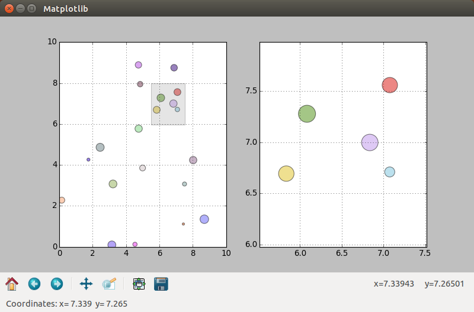

.. _zooming:

Zooming in on data
==================
This chapter will show how you can zoom in on your data. This is a common feature of programs for data analysis. This is the first tutorial that will make use of *classes*. If you are new to Python you might want to review some simple examples first before reading on (See *Further Reading* at bottom of page).

Simple Zoom-Subplot
-------------------
In the first example we will create a simple collection of random points, with random size and random color. Zooming on some of the points will create a rectangle that highlights the zoomed area. The zoom-graph itself will show the points enlarged, as we don't want to produce mileading precision (*This will be useful in the example with error bars*).

To get you motivated or if you want to try to build the program yourself the next figure will show the finished example I came up with.

    The left window shows the original data and the right window the zoomed data. The zoomed area is highlighted and the points are enlarged according to the zoomfactor.
    
At the beginning of the code we will import the usual modules. New is the import of the *Rectangle* function which we will use to plot a rectangle within the graph.

::

    #!/usr/bin/python3
    
    from gi.repository import Gtk
    from matplotlib.figure import Figure
    from numpy import random
    from matplotlib.backends.backend_gtk3agg import FigureCanvasGTK3Agg as FigureCanvas
    from matplotlib.backends.backend_gtk3 import NavigationToolbar2GTK3 as NavigationToolbar
    from matplotlib.patches import Rectangle

The *DrawPoints* class will do most of the work in this example. On init, we will define some variables and set up the 2 subplots. Each subplot has its own drawing function, which clears the subplot, before drawing. The *zoom* function recycles the *draw* and *drawzoom* function.
    
::

    class DrawPoints:
        '''Creates random points, 2 axis on 1 figure on 1 canvas on init. Allows for drawing and zooming of points.'''
        def __init__(self):
            self.n = 20
            self.xrand = random.rand(1,self.n)*10
            self.yrand = random.rand(1,self.n)*10
            self.randsize = random.rand(1,self.n)*200
            self.randcolor = random.rand(self.n,3)

            self.fig = Figure(figsize=(10,10), dpi=80)
            self.ax = self.fig.add_subplot(121)
            self.axzoom = self.fig.add_subplot(122)
            self.canvas = FigureCanvas(self.fig)
        def draw(self):
            '''Draws the ax-subplot'''
            self.ax.cla()
            self.ax.grid(True)
            self.ax.set_xlim(0,10)
            self.ax.set_ylim(0,10)
            self.ax.scatter(self.xrand, self.yrand, marker='o', s=self.randsize, c=self.randcolor, alpha=0.5)
        def drawzoom(self):
            '''Draws the axzoom-suplot'''
            self.axzoom.cla()
            self.axzoom.grid(True)
            self.axzoom.set_xlim(self.x-1, self.x+1)
            self.axzoom.set_ylim(self.y-1, self.y+1)
            self.axzoom.scatter(self.xrand, self.yrand, marker='o', s=self.randsize*5, c=self.randcolor, alpha=0.5)
        def zoom(self, x, y):
            '''Adds a rectangle to the zoomed area of the ax-graph and updates the axzoom-graph'''
            self.x = x
            self.y = y
            self.draw()
            self.drawzoom()
            self.ax.add_patch(Rectangle((x - 1, y - 1), 2, 2, facecolor="grey", alpha=0.2))
            self.fig.canvas.draw()

The function *updatecursorposition* is activated when the mouse moves over the graph. The x and y coordinates are then send to the *GtkStatusbar*.
            
::
          
    def updatecursorposition(event):
        '''When cursor inside plot, get position and print to statusbar'''
        if event.inaxes:
            x = event.xdata
            y = event.ydata
            statbar.push(1, ("Coordinates:" + " x= " + str(round(x,3)) + "  y= " + str(round(y,3))))

The *updatezoom* function is activated when the mouse is clicked inside the graph. It then checks for the left mouse button, and if the event is a number (meaning not the Python None-Type). Then the coordinates are forwarded to the *zoom* function (Later in the program we will create an instance of the class called *points()* and that is why we call *points.zoom()*).

::

    def updatezoom(event):
        '''When mouse is right-clicked on the canvas get the coordiantes and send them to points.zoom'''
        if event.button!=1: return
        if (event.xdata is None): return
        x,y = event.xdata, event.ydata
        points.zoom(x,y)

The rest of the program goes through the usual setting up, of the Gtk window and the containers. We also define an instance of the *DrawPoints* class and call *points.draw() to draw the initial graph. Two event triggers are connected with the canvas (*points.fig.canvas*) and the appropriate functions are called (*updatecursorposition* for mouse motion and *updatezoom* for mouse clicks)

::

    window = Gtk.Window()
    window.connect("delete-event", Gtk.main_quit)
    window.set_default_size(800, 500)
    window.set_title('Matplotlib')

    box = Gtk.Box(orientation=Gtk.Orientation.VERTICAL)
    window.add(box)

    points = DrawPoints()
    points.draw()

    box.pack_start(points.canvas, True, True, 0)

    toolbar = NavigationToolbar(points.canvas, window)
    box.pack_start(toolbar, False, True, 0)

    statbar = Gtk.Statusbar()
    box.pack_start(statbar, False, True, 0)

    points.fig.canvas.mpl_connect('motion_notify_event', updatecursorposition)
    points.fig.canvas.mpl_connect('button_press_event', updatezoom)

    window.show_all()
    Gtk.main()

This is the code of the whole example:
    
::

    #!/usr/bin/python3

    from gi.repository import Gtk
    from matplotlib.figure import Figure
    from numpy import random
    from matplotlib.backends.backend_gtk3agg import FigureCanvasGTK3Agg as FigureCanvas
    from matplotlib.backends.backend_gtk3 import NavigationToolbar2GTK3 as NavigationToolbar
    from matplotlib.patches import Rectangle

    class DrawPoints:
        '''Creates random points, 2 axis on 1 figure on 1 canvas on init. Allows for drawing and zooming of points.'''
        def __init__(self):
            self.n = 20
            self.xrand = random.rand(1,self.n)*10
            self.yrand = random.rand(1,self.n)*10
            self.randsize = random.rand(1,self.n)*200
            self.randcolor = random.rand(self.n,3)

            self.fig = Figure(figsize=(10,10), dpi=80)
            self.ax = self.fig.add_subplot(121)
            self.axzoom = self.fig.add_subplot(122)
            self.canvas = FigureCanvas(self.fig)
        def draw(self):
            '''Draws the ax-subplot'''
            self.ax.cla()
            self.ax.grid(True)
            self.ax.set_xlim(0,10)
            self.ax.set_ylim(0,10)
            self.ax.scatter(self.xrand, self.yrand, marker='o', s=self.randsize, c=self.randcolor, alpha=0.5)
        def drawzoom(self):
            '''Draws the axzoom-suplot'''
            self.axzoom.cla()
            self.axzoom.grid(True)
            self.axzoom.set_xlim(self.x-1, self.x+1)
            self.axzoom.set_ylim(self.y-1, self.y+1)
            self.axzoom.scatter(self.xrand, self.yrand, marker='o', s=self.randsize*5, c=self.randcolor, alpha=0.5)
        def zoom(self, x, y):
            '''Adds a rectangle to the zoomed area of the ax-graph and updates the axzoom-graph'''
            self.x = x
            self.y = y
            self.draw()
            self.drawzoom()
            self.ax.add_patch(Rectangle((x - 1, y - 1), 2, 2, facecolor="grey", alpha=0.2))
            self.fig.canvas.draw()
          
    def updatecursorposition(event):
        '''When cursor inside plot, get position and print to statusbar'''
        if event.inaxes:
            x = event.xdata
            y = event.ydata
            statbar.push(1, ("Coordinates:" + " x= " + str(round(x,3)) + "  y= " + str(round(y,3))))

    def updatezoom(event):
        '''When mouse is right-clicked on the canvas get the coordiantes and send them to points.zoom'''
        if event.button!=1: return
        if (event.xdata is None): return
        x,y = event.xdata, event.ydata
        points.zoom(x,y)

    window = Gtk.Window()
    window.connect("delete-event", Gtk.main_quit)
    window.set_default_size(800, 500)
    window.set_title('Matplotlib')

    box = Gtk.Box(orientation=Gtk.Orientation.VERTICAL)
    window.add(box)

    points = DrawPoints()
    points.draw()

    box.pack_start(points.canvas, True, True, 0)

    toolbar = NavigationToolbar(points.canvas, window)
    box.pack_start(toolbar, False, True, 0)

    statbar = Gtk.Statusbar()
    box.pack_start(statbar, False, True, 0)

    points.fig.canvas.mpl_connect('motion_notify_event', updatecursorposition)
    points.fig.canvas.mpl_connect('button_press_event', updatezoom)

    window.show_all()
    Gtk.main() 

Simple Zoom-Subplot with Glade
^^^^^^^^^^^^^^^^^^^^^^^^^^^^^^
This example doesn't require any additional Glade structures than the examples before. Just another container for the *GtkToolbar*. You should have no trouble converting the example yourself.

Further Reading
---------------
 - The Python Tutorial: `Classes <https://docs.python.org/3.4/tutorial/classes.html>`_
 - Matplotlib API `Patch collection example <http://matplotlib.org/examples/api/patch_collection.html>`_

